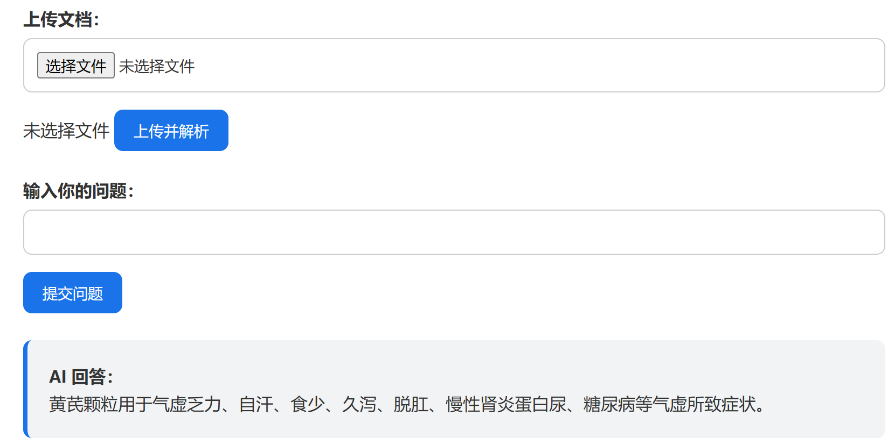

# LocalDocQA 🌿📄

这是一个轻量级的本地 AI 文档问答系统，支持上传 PDF 文件并进行智能问答，适用于中英文资料的阅读与理解，特别适合中药、医药类 PDF 文档的交互式解析。

> ✨ 支持 LangChain 向量检索  
> ✨ 支持讯飞星火 API 回答（无需本地大模型）  
> ✨ 无需 GPU，低资源环境可运行  

---

## 🚀 功能特性

- 📄 支持 PDF 文件上传并解析
- 🔍 向量化切块 + FAISS 本地检索
- 💬 支持问题输入，智能回答
- ⚙️ 集成 LangChain（用于构建知识库）
- 🤖 使用讯飞星火 Spark API 调用大语言模型回答
- 🖥️ 简洁交互式网页界面，支持上传文件名显示、输入框回车提交、AI loading 动画等交互优化

---

## 🧩 技术栈

| 分类       | 技术                         |
|------------|------------------------------|
| 编程语言   | Python                       |
| 后端框架   | Flask                        |
| 向量数据库 | FAISS                        |
| 向量化工具 | HuggingFaceEmbeddings / text2vec |
| LLM 接口   | 讯飞星火 SparkDesk API       |
| 前端       | HTML + CSS                   |
| 文档处理   | PyMuPDF                      |

---

## 🖼️ 项目展示

> 示例页面：上传一个关于“黄芪颗粒”的说明书 PDF 后，提问“它有什么作用？”



---

## 📂 文件结构

```bash
LocalDocQA/
├── app/
│   ├── __init__.py
│   └── views.py                  # Flask 路由视图函数
│
├── docs/
│   └── test.pdf                  # 示例 PDF（可删除）
│
├── knowledge_base/
│   ├── index_texts.pkl          # 存储切块后的文本内容
│   ├── index.faiss              # FAISS 向量索引
│   ├── index.index              # 索引元信息
│   └── index.pkl                # 向量模型缓存（可弃用）
│
├── models/
│   └── text2vec-base-chinese/   # 本地嵌入模型（可手动下载）
│
├── static/
│   └── style.css                # 前端样式
│
├── templates/
│   └── index.html               # 网页主界面
│
├── utils/
│   ├── doc_parser.py            # PDF 文档解析
│   ├── embedder.py              # 原始嵌入逻辑（如弃用可删除）
│   ├── glm_infer.py             # 调用讯飞星火接口
│   ├── langchain_embedder.py    # 使用 LangChain 构建知识库
│   └── qa_chain.py              # 可选：未来多轮对话逻辑
│
├── .gitignore                   # Git 忽略规则
├── app.py                       # Flask 应用入口
├── config.py                    # 配置讯飞 API Key（需脱敏）
├── requirements.txt             # 项目依赖
```

---

## 📦 安装与运行

```bash
# 克隆项目（第一次使用）
git clone https://github.com/你的用户名/LocalDocQA.git
cd LocalDocQA

# 创建虚拟环境（可选）
python -m venv .venv
.venv\Scripts\activate   # Windows

# 安装依赖
pip install -r requirements.txt

# 启动项目
python app.py
```

---

## 🔧 配置说明

请在 `config.py` 中填写你的讯飞星火 API 信息：

```python
SPARK_APPID = "your_appid"
SPARK_API_KEY = "your_apikey"
SPARK_API_SECRET = "your_secret"
SPARK_DOMAIN = "general"  # 通常是 general/generalv2/generalv3
SPARK_URL = "wss://spark-api.xf-yun.com/v3.5/chat"
```

> 🚫 请勿上传包含真实 API 密钥的 config.py 文件到公开仓库！

---

## 🛠️ 使用方法

1. 访问 `http://127.0.0.1:5000`
2. 上传你的 PDF 文档
3. 在输入框提问相关内容
4. AI 将基于文档 + 问题生成精准回答 ✨

---

## ❤️ 鸣谢

本项目参考并整合以下优秀项目和工具：

- [LangChain](https://github.com/langchain-ai/langchain)
- [讯飞星火 API](https://xinghuo.xfyun.cn/)
- [FAISS](https://github.com/facebookresearch/faiss)
- [Text2Vec 中文嵌入模型](https://huggingface.co/GanymedeNil/text2vec-base-chinese)

---

## ✨ 联系作者

作者：leaHachiware
联系：请通过 GitHub issue 留言交流~

---

## ⭐ 欢迎 Star 支持！

如果这个项目对你有帮助，欢迎点个小星星 ⭐  
你的一点支持是我继续优化的最大动力！
